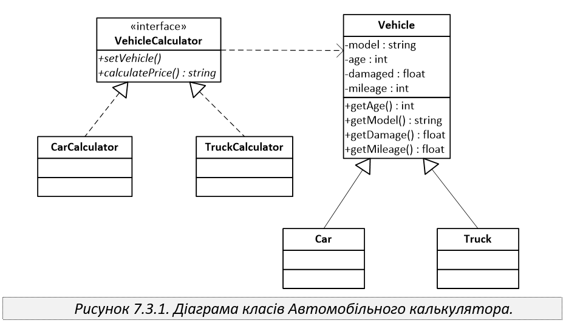
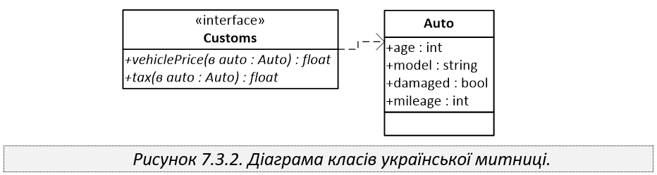

Автомобільний калькулятор .
=======================

На американському аукціоні для визначення вартості вживаного
автомобіля використовується спеціальна програма –
Автомобільний калькулятор – яка обчислює вартість автомобіля
залежно від моделі, його віку, пробігу та ступеня пошкодження
внаслідок дорожньо-транспортної пригоди.

Вартість автомобіля обчислюється методом calculatePrice(),
що повертає результат у доларах США.

Нижче наведено орієнтовну діаграму класів Автомобільного калькулятора та української митниці, відповідно.

Українська митниця вирішила для обчислення
вартості автомобіля, розміру мита та повної вартості автомобіля
після розмитнення використовувати цей автомобільний калькулятор.
Проте, програмне забезпечення, що використовує митниця вже
розроблене та затверджене, крім цього всі розрахунки на митниці
ведуться у гривнях.

Реалізуйте шаблон Адаптер, для того, щоб адаптувати програмне
забезпечення Автомобільного калькулятора для потреб української
митниці.

*Зауваження* Бібліотека, що викорстовується у проекті зібрана за
допомогою компілятора Java 11.
