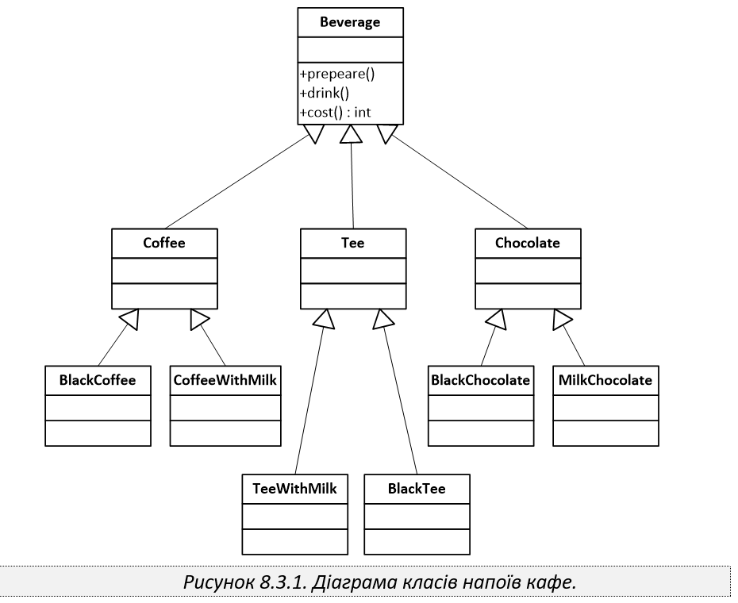

Кав'ярня.
=======================

Розглянемо діаграму класів, що наведена на рисунку 8.3.1, 
яка описує структуру напоїв, що виготовляються у деякій невеликій
кав’ярні. 

Проведіть рефакторинг класів, цього проекту з застосуванням шаблону
проектування Міст. По тому, додайте відповідні класи для можливості
готування напоїв для вживання їх як в ресторані, так і «на винос».