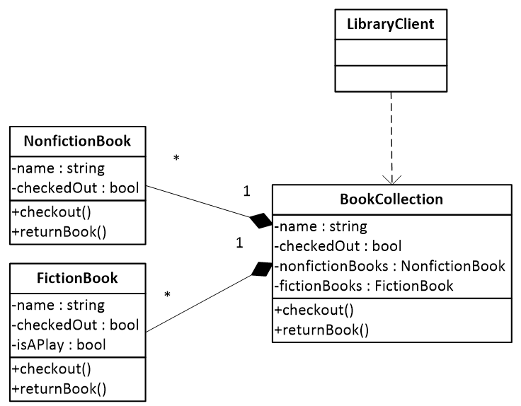

# Бібліотека

Розглядається бібліотека, що може містити художні та 
документальні книжки. Кожна книга, як художня, так 
і документальна має назву та ознаку чи вона доступна 
для замовлення у бібліотеці. Крім цього художня книжка 
має ознаку чи є твір викладений в ній п'єсою. 

Для кожної книги, зокрема, та бібліотеки, в цілому, 
визначені операції – замовити (тобто, забронювати) книгу,
якщо вона доступна для резервування, та повернути її 
до бібліотеки (зробити доступною для замовлення іншим 
клієнтам).

Проведіть рефакторинг коду, із застосуванням шаблону 
проєктування Компонувальник для більш гнучкого керування 
бібліотекою.

