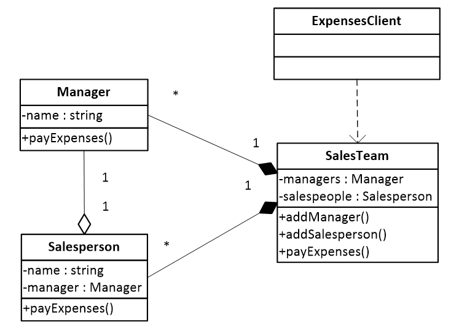

# Продуктовий супермаркет

Розглянемо модель магазину, що містить два типи 
співробітників – менеджери та продавці.
Всі співробітники магазину отримують заробітну 
платню відповідно до посади. Наша модель нараховує
заробітну плату для всіх співробітників магазину.

Проведіть рефакторинг коду, із застосуванням 
шаблону проєктування Компонувальник так щоб програма
могла розрахувати виплату заробітної плати працівникам
супермаркету, що очолюється директором (менеджером) 
містить три відділи (м’ясний відділ, відділ молокопродуктів,
кондитерський відділ), кожен з яких очолюється менеджером,
та містить принаймні трьох співробітників-продавців.
