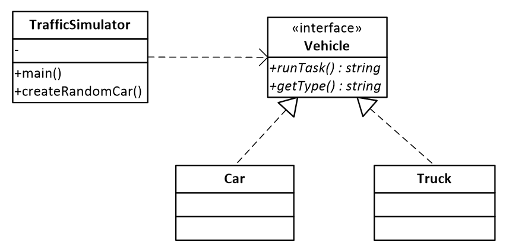

# Вантажні перевезення

Розглядається проста модель перевезень вантажним транспортом
вантажів та пасажирів легковим транспортом.

При цьому клієнт TrafficSimulator багаторазово створює
та використовує об’єкти екземплярів класів Car та Truck,
що реалізовують інтерфейс Vehicle.

Реалізуйте шаблон програмування Легковаговик,
для повторного використання об’єктів класів Car та Truck.