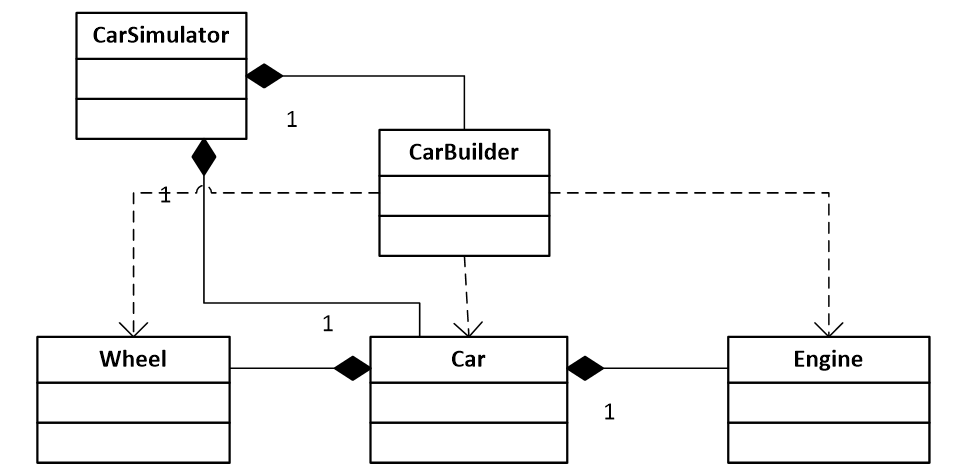

# Автоконструктор

Більшість автомобілів складається з великої кількості 
деталей таких як двигун, колеса, кермо тощо. 
Під час збірки автомобіля у нього встановлюють типові запчастини,
що повторюються у багатьох модифікаціях.
Відповідно, програмуючи деяку гру чи симулятор, що використовує подібні ієрархії класів можна суттєво заощадити оперативну пам’ять та зменшити час створення об’єктів класу Car, якщо закешувати однакові деталі.
Нижче наведено просту ієрархію такого симулятора.

Реалізуйте шаблон проєктування Легковаговик для повторного 
використання створених раніше об'єктів для різних частин автомобіля.