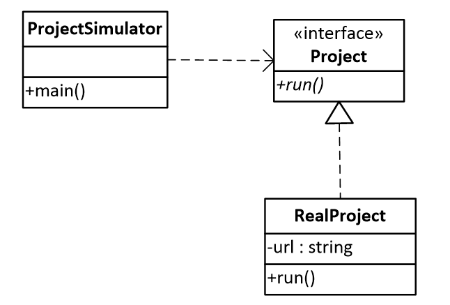

# Симулятор проєктів

Розглядається симулятор проєкт, 
діаграма класів якого наведено на рисунку нижче

Клієнт ProjectSimulator завантажує перелік проєкт 
зі сервера GitHub відповідно до їхніх url адрес та 
запускає один з проєкт на виконання.

Реалізуйте шаблон проєктування Замісник, таким чином,
щоб уникнути завантаження проєкт з сервера,
якщо вони не будуть запускатися на виконання.