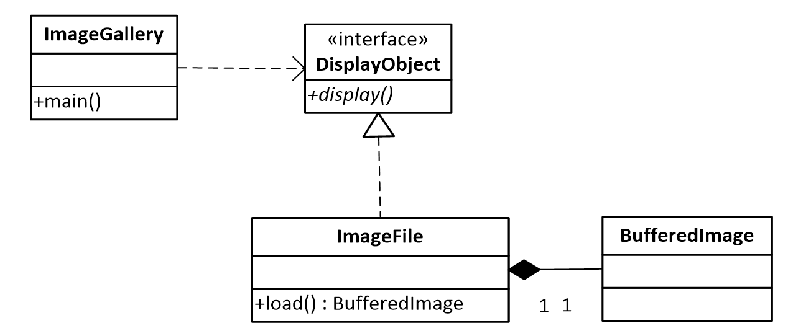

# Image Gallery

Розглядається програма призначена для послідовного 
виведення зображень на екран. 
Діаграма класів проєкт наведена на рисунку нижче

Реалізуйте шаблон проєктування Замісник, таким чином, 
щоб уникнути завантаження зображень з носія інформації, 
до безпосереднього їхнього виведення на екран.
