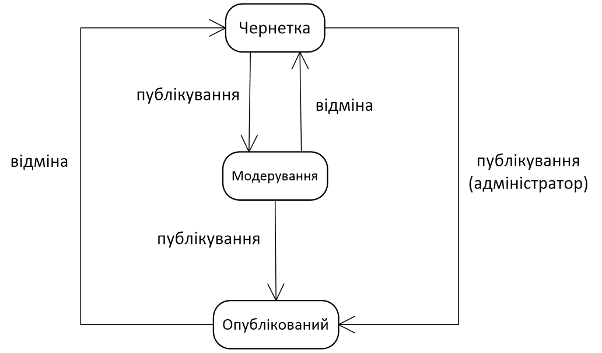

# Публікація документу

Реалізуйте шаблон проєктування Стан на прикладі документа, 
що може знаходитися в одному з трьох станів – чернетка, 
модерування, опублікований.

Схема переходу зі стану до стану зображена на рисунку нижче

